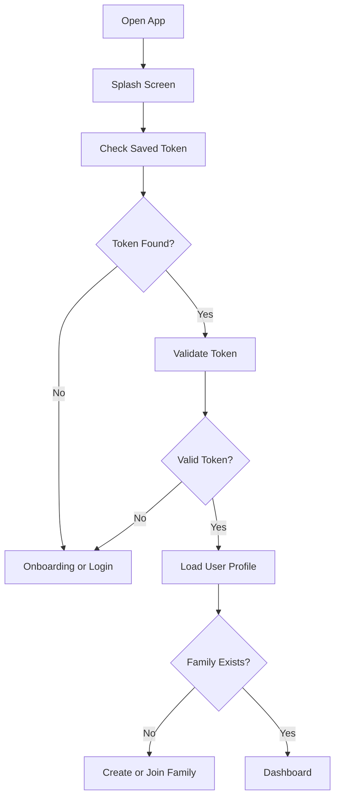
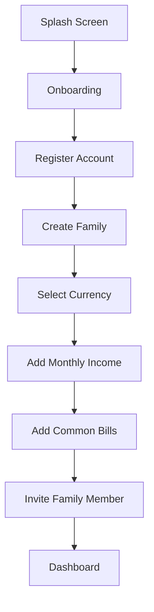
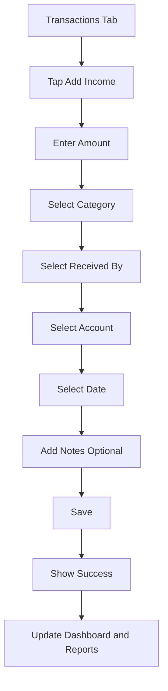
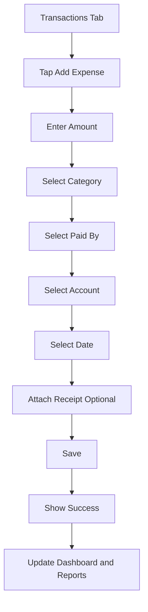
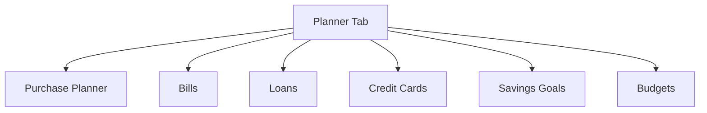
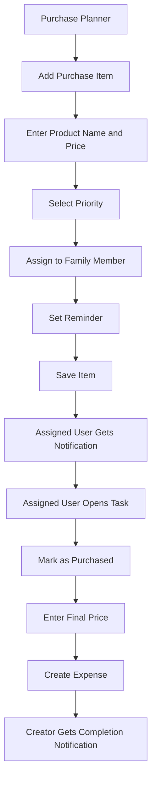
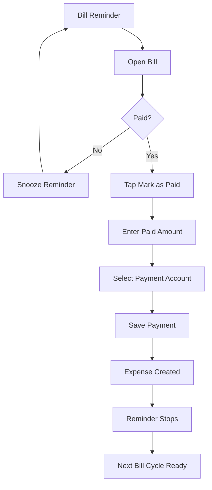
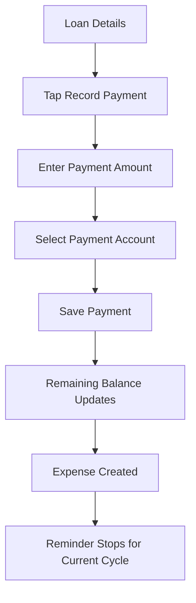
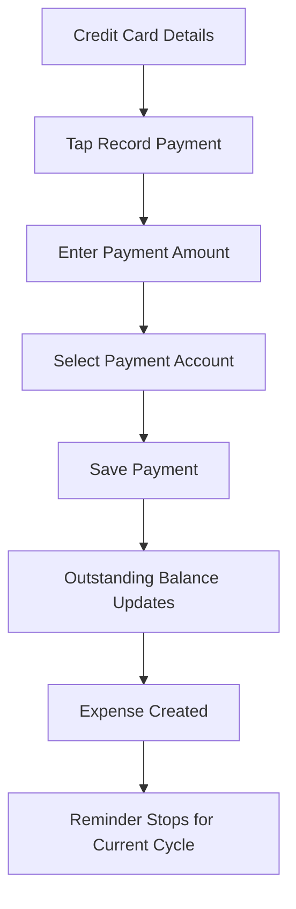
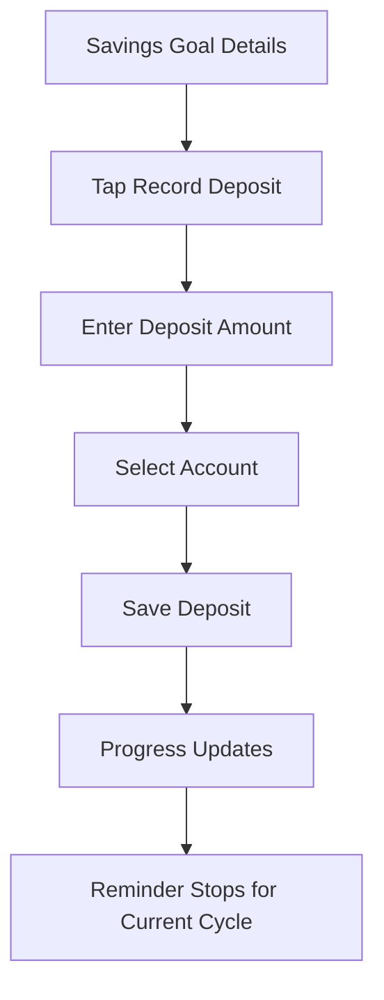

# Family Finance App

## Flutter App Flow, Screen Planning, UI Structure, and AI Agent Guide

---

# 1. App Goal

Build a Flutter mobile app for a small family to manage:

* Monthly income
* Monthly expenses
* Family member contribution
* Bills
* Loans
* Credit card payments
* Savings goals
* Purchase planning
* Assigned purchase tasks
* Reminders
* Monthly reports
* Budget tracking
* Expense reduction suggestions

The app should be clean, simple, family-friendly, and easy to use for both husband and wife.

Flutter supports building apps from one codebase for iOS and Android, and the official Flutter architecture guide recommends separating UI, business logic, and data layers for maintainable apps. The app should follow this layered approach.

---

# 2. Flutter App Main Navigation

Use bottom navigation with five main tabs:

```text
Home
Transactions
Planner
Reports
More
```

## 2.1 Home

Purpose:

* Show family financial summary
* Show upcoming payments
* Show urgent purchase items
* Show reminders
* Provide quick actions

## 2.2 Transactions

Purpose:

* Add income
* Add expense
* View all transactions
* Filter by date, category, member, and account

## 2.3 Planner

Purpose:

* Manage purchase planner
* Manage bills
* Manage loans
* Manage credit cards
* Manage savings goals
* Manage budgets

## 2.4 Reports

Purpose:

* Monthly report
* Category report
* Contribution report
* Budget report
* Debt report
* Savings report

## 2.5 More

Purpose:

* Profile
* Family members
* Categories
* Accounts
* Notifications
* Settings
* Security

---

# 3. Recommended Flutter Architecture

Use a feature-first structure.

Each feature should contain:

```text
data
domain
presentation
```

Flutter’s official app architecture guide describes the data layer as the source of truth for app data, so API calls, local cache, and repositories should stay outside the UI layer.

---

# 4. Recommended State Management

Use one of these:

```text
Option 1: Riverpod
Option 2: Provider
```

Recommended choice:

```text
Riverpod
```

Reason:

* Clean dependency management
* Good for feature-based apps
* Easy to test
* Good for API + local cache structure

Flutter documentation lists several state management approaches, and Provider is presented as a simple starting option; Riverpod is a strong choice when the project needs more structure.

---

# 5. Recommended Routing

Use:

```text
go_router
```

Reason:

* Clean route declaration
* Supports authentication redirect
* Supports nested navigation
* Suitable for bottom navigation
* Supports deep linking later

Flutter supports both simple `Navigator` and the more advanced `Router` approach for apps with deeper navigation and linking needs.

---

# 6. Flutter Project Folder Structure

```text
lib/
├── main.dart
│
├── app/
│   ├── app.dart
│   ├── router.dart
│   ├── theme.dart
│   ├── app_config.dart
│   └── app_constants.dart
│
├── core/
│   ├── api/
│   │   ├── api_client.dart
│   │   ├── api_endpoints.dart
│   │   ├── api_exception.dart
│   │   └── api_response.dart
│   │
│   ├── auth/
│   │   ├── auth_guard.dart
│   │   └── token_storage.dart
│   │
│   ├── cache/
│   │   ├── local_storage.dart
│   │   └── secure_storage.dart
│   │
│   ├── constants/
│   │   ├── app_colors.dart
│   │   ├── app_icons.dart
│   │   ├── app_sizes.dart
│   │   └── app_strings.dart
│   │
│   ├── errors/
│   │   ├── failure.dart
│   │   └── error_handler.dart
│   │
│   ├── helpers/
│   │   ├── date_helper.dart
│   │   ├── money_helper.dart
│   │   └── validation_helper.dart
│   │
│   ├── notifications/
│   │   ├── notification_service.dart
│   │   ├── firebase_notification_service.dart
│   │   └── local_notification_service.dart
│   │
│   ├── network/
│   │   ├── connectivity_service.dart
│   │   └── network_info.dart
│   │
│   └── widgets/
│       ├── app_button.dart
│       ├── app_text_field.dart
│       ├── app_dropdown.dart
│       ├── app_card.dart
│       ├── amount_text.dart
│       ├── empty_state.dart
│       ├── loading_view.dart
│       ├── error_view.dart
│       ├── confirmation_dialog.dart
│       └── section_header.dart
│
├── features/
│   ├── splash/
│   ├── onboarding/
│   ├── authentication/
│   ├── family/
│   ├── dashboard/
│   ├── income/
│   ├── expense/
│   ├── transaction/
│   ├── account/
│   ├── category/
│   ├── budget/
│   ├── bill/
│   ├── credit_card/
│   ├── loan/
│   ├── savings/
│   ├── purchase_planner/
│   ├── reminder/
│   ├── notification_center/
│   ├── report/
│   └── settings/
│
└── shared/
    ├── models/
    ├── enums/
    └── widgets/
```

---

# 7. Feature Folder Structure Example

Each feature should follow this pattern.

Example: `expense`

```text
features/expense/
├── data/
│   ├── datasources/
│   │   ├── expense_remote_datasource.dart
│   │   └── expense_local_datasource.dart
│   │
│   ├── models/
│   │   └── expense_model.dart
│   │
│   └── repositories/
│       └── expense_repository_impl.dart
│
├── domain/
│   ├── entities/
│   │   └── expense.dart
│   │
│   ├── repositories/
│   │   └── expense_repository.dart
│   │
│   └── usecases/
│       ├── create_expense_usecase.dart
│       ├── update_expense_usecase.dart
│       ├── delete_expense_usecase.dart
│       ├── get_expense_usecase.dart
│       └── list_expenses_usecase.dart
│
└── presentation/
    ├── providers/
    │   ├── expense_provider.dart
    │   └── expense_form_provider.dart
    │
    ├── screens/
    │   ├── expense_list_screen.dart
    │   ├── expense_form_screen.dart
    │   └── expense_details_screen.dart
    │
    └── widgets/
        ├── expense_card.dart
        ├── expense_filter_sheet.dart
        └── expense_summary_card.dart
```

All major features should follow this structure.

---

# 8. App Startup Flow

```text
Open App
    ↓
Splash Screen
    ↓
Check Token
    ↓
Check Internet
    ↓
If Logged In → Dashboard
    ↓
If Not Logged In → Onboarding or Login
```

## Mermaid Flow



---

# 9. First-Time User Flow

```text
Splash
    ↓
Onboarding
    ↓
Register
    ↓
Create Family
    ↓
Select Currency
    ↓
Add Monthly Income
    ↓
Add Common Bills
    ↓
Invite Wife or Family Member
    ↓
Dashboard
```



---

# 10. Authentication Screens

## 10.1 Splash Screen

Show:

* App logo
* App name
* Loading indicator

Logic:

* Check saved access token
* Check if onboarding completed
* Redirect user

---

## 10.2 Onboarding Screen

Use 3 to 4 slides.

Slide examples:

```text
Slide 1:
Track your family income and expenses.

Slide 2:
Plan bills, loans, credit cards, and savings.

Slide 3:
Assign shopping tasks and get reminders.

Slide 4:
Understand where your money goes every month.
```

Actions:

* Next
* Skip
* Get Started

---

## 10.3 Login Screen

Fields:

* Email or phone
* Password

Actions:

* Login
* Forgot password
* Create account

Validation:

* Email or phone required
* Password required

---

## 10.4 Register Screen

Fields:

* Full name
* Email
* Phone
* Password
* Confirm password

Actions:

* Register
* Already have account? Login

---

## 10.5 Forgot Password Screen

Fields:

* Email or phone

Actions:

* Send reset code

---

# 11. Family Setup Screens

## 11.1 Create Family Screen

Fields:

* Family name
* Currency
* Monthly start day

Example:

```text
Family Name: Rahman Family
Currency: BDT
Month Start Day: 1
```

---

## 11.2 Invite Family Member Screen

Fields:

* Name
* Email or phone
* Role

Actions:

* Send invitation
* Skip for now

---

## 11.3 Family Member List Screen

Show:

* Member name
* Role
* Contribution this month
* Status

Actions:

* Invite new member
* View member details
* Remove member

---

# 12. Home Dashboard Screen

## 12.1 Dashboard UI Sections

### Header

```text
Good evening, Arup
Rahman Family
June 2026
```

### Monthly Summary Card

```text
Total Income: ৳150,000
Total Expense: ৳105,000
Remaining: ৳45,000
Suggested Savings: ৳30,000
```

### Contribution Card

```text
Arup: ৳90,000
Wife: ৳60,000
```

### Budget Progress Card

```text
Budget Used: 78%
Remaining Budget: ৳22,000
```

### Upcoming Payments Card

```text
Electricity Bill — Due Jun 15
Credit Card — Due Jun 20
Loan EMI — Due Jun 25
```

### Priority Purchase Card

```text
Medicine — Urgent
Rice — High
Kitchen Shelf — Medium
```

### Quick Action Buttons

```text
Add Expense
Add Income
Add Purchase
Add Bill
Record Savings
```

---

## 12.2 Dashboard Screen Behavior

When user opens dashboard:

1. Show cached dashboard data first if available.
2. Call dashboard API.
3. Refresh dashboard data.
4. Show loading only for first-time load.
5. Show error state if no cache and API fails.
6. Pull-to-refresh reloads dashboard.
7. User can change selected month.

Flutter’s offline-first guidance recommends showing locally stored data where possible and synchronizing with the server when available.

---

# 13. Transactions Flow

## 13.1 Transaction Tab

Sections:

```text
Monthly Summary
Income
Expenses
All Transactions
```

Filters:

* Date range
* Category
* Member
* Account
* Transaction type

---

## 13.2 Add Income Flow



## 13.3 Add Income Screen

Fields:

* Amount
* Title
* Category
* Received by
* Account
* Date
* Recurring switch
* Notes

Buttons:

* Save Income
* Cancel

---

## 13.4 Add Expense Flow



## 13.5 Add Expense Screen

Fields:

* Amount
* Title
* Category
* Paid by
* Payment account
* Date
* Receipt image
* Notes

Buttons:

* Save Expense
* Cancel

---

# 14. Planner Tab Flow

Planner tab should contain cards for:

```text
Purchase Planner
Bills
Loans
Credit Cards
Savings Goals
Budgets
```



---

# 15. Purchase Planner Flow

## 15.1 Purchase Planner List Screen

Show tabs:

```text
All
Urgent
Assigned to Me
Completed
```

Each item card should show:

* Product name
* Estimated price
* Priority
* Assigned person
* Needed by date
* Status

Actions:

* Add item
* Edit item
* Assign item
* Mark as purchased
* Cancel item

---

## 15.2 Add Purchase Item Screen

Fields:

* Product name
* Estimated price
* Category
* Priority
* Needed by date
* Assigned to
* Reminder date and time
* Notes
* Product image
* Purchase link

---

## 15.3 Assign Purchase Flow



---

# 16. Bill Flow

## 16.1 Bill List Screen

Show tabs:

```text
Upcoming
Paid
Overdue
All
```

Bill card should show:

* Bill name
* Expected amount
* Due date
* Assigned person
* Status
* Reminder badge

---

## 16.2 Add Bill Screen

Fields:

* Bill name
* Bill type
* Expected amount
* Due date
* Repeat frequency
* Assigned person
* Reminder days before
* Reminder time
* Notes

---

## 16.3 Bill Payment Flow



---

# 17. Loan Flow

## 17.1 Loan List Screen

Show:

* Loan name
* Lender
* Remaining balance
* Monthly installment
* Next due date
* Progress percentage

---

## 17.2 Add Loan Screen

Fields:

* Loan name
* Lender name
* Original amount
* Remaining balance
* Installment amount
* Interest rate optional
* Start date
* Due day
* Expected end date
* Assigned person
* Reminder settings

---

## 17.3 Loan Payment Flow



---

# 18. Credit Card Flow

## 18.1 Credit Card List Screen

Show:

* Card name
* Bank name
* Last four digits
* Limit
* Outstanding balance
* Due date
* Minimum payment

---

## 18.2 Add Credit Card Screen

Fields:

* Card name
* Bank name
* Last four digits
* Credit limit
* Outstanding balance
* Statement day
* Due day
* Minimum payment
* Assigned person
* Reminder settings

Important rule:

```text
Never ask for full card number.
Never ask for CVV.
Only store last four digits.
```

---

## 18.3 Credit Card Payment Flow



---

# 19. Savings Flow

## 19.1 Savings Goal List Screen

Show:

* Goal name
* Target amount
* Current amount
* Progress percentage
* Monthly target
* Next deposit date

---

## 19.2 Add Savings Goal Screen

Fields:

* Goal name
* Goal type
* Target amount
* Current amount
* Monthly deposit target
* Deposit due day
* Target date
* Assigned person
* Reminder settings
* Notes

---

## 19.3 Savings Deposit Flow



---

# 20. Budget Flow

## 20.1 Budget Screen

Show:

* Current month budget
* Total budget
* Total spent
* Remaining budget
* Category-wise budget progress

---

## 20.2 Add Budget Screen

Fields:

* Month
* Total budget
* Category budgets
* Warning percentage

---

## 20.3 Budget Progress UI

Use progress bars:

```text
Groceries
৳12,500 / ৳15,000
83% used

Medical
৳6,000 / ৳5,000
Over budget by ৳1,000
```

---

# 21. Reminder Flow

## 21.1 Reminder List Screen

Show tabs:

```text
Today
Upcoming
Completed
Snoozed
```

Reminder card should show:

* Title
* Message
* Related type
* Date and time
* Assigned user
* Status

Actions:

* Complete
* Snooze
* Open related item

---

## 21.2 Reminder Notification Behavior

The app should support:

* Local reminder notification
* Remote push notification
* Assigned task notification
* Payment due notification
* Budget warning notification

Firebase Cloud Messaging can receive messages in Flutter apps, and iOS setup requires push notification and background mode configuration in Xcode.

---

# 22. Reports Flow

## 22.1 Reports Home Screen

Cards:

```text
Monthly Summary
Category Expenses
Family Contribution
Budget vs Actual
Debt Summary
Savings Progress
Yearly Summary
```

---

## 22.2 Monthly Summary Report

Show:

* Total income
* Total expense
* Remaining balance
* Savings
* Debt payments
* Comparison with previous month

---

## 22.3 Category Expense Report

Show:

* Pie chart
* Category list
* Amount
* Percentage
* Budget comparison

---

## 22.4 Family Contribution Report

Show:

* Member name
* Income contribution
* Expense contribution
* Savings contribution
* Total contribution

---

## 22.5 Debt Summary Report

Show:

* Total loan balance
* Total credit card outstanding
* Upcoming payment amount
* Debt reduction progress

---

## 22.6 Savings Report

Show:

* Total saved
* Goal progress
* Remaining amount
* Estimated completion date

---

# 23. More Tab Flow

More tab contains:

```text
Profile
Family Members
Accounts
Categories
Notifications
Settings
Security
Language
Help
Logout
```

---

# 24. UI Design Guidelines

## 24.1 Visual Style

The app should look:

* Clean
* Calm
* Modern
* Family-friendly
* Easy to read
* Not too colorful
* Not like complex accounting software

---

## 24.2 Suggested Color System

```text
Primary: Deep Blue or Deep Green
Success: Green
Warning: Orange
Danger: Red
Background: Soft Gray
Card: White
Text Primary: Dark Charcoal
Text Secondary: Gray
```

---

## 24.3 Card Style

Use card-based UI for:

* Dashboard summary
* Expense item
* Income item
* Bill item
* Loan item
* Savings goal
* Purchase item
* Reminder item

Card should include:

* Rounded corners
* Small shadow or soft border
* Clear title
* Amount
* Status badge
* Date
* Main action

---

## 24.4 Amount Display Rule

Amounts should be large and clear.

Example:

```text
৳12,500
৳150,000
৳45,000
```

Use helper function:

```text
formatMoney(amount, currency)
```

---

## 24.5 Empty State Design

Every list screen needs an empty state.

Examples:

```text
No expenses added yet.
Add your first expense to start tracking your family spending.

[Add Expense]
```

```text
No purchase items planned.
Create a shopping plan and assign tasks to family members.

[Add Purchase Item]
```

---

## 24.6 Loading State

Use:

* Skeleton loading for dashboard cards
* Circular loading for submit buttons
* Pull-to-refresh for lists

---

## 24.7 Error State

Show:

* Friendly message
* Retry button

Example:

```text
Could not load your dashboard.
Please check your internet connection and try again.

[Retry]
```

---

# 25. Reusable Widgets

Create reusable widgets:

```text
AppButton
AppTextField
AppDropdown
AppDatePickerField
AppAmountField
AppCard
SummaryCard
ProgressCard
MoneyText
StatusBadge
PriorityBadge
MemberAvatar
EmptyState
ErrorView
LoadingView
ConfirmationDialog
BottomSheetPicker
SectionHeader
FilterChipGroup
TransactionCard
ReminderCard
```

---

# 26. Form Validation Rules

## 26.1 Common Amount Validation

```text
Amount is required.
Amount must be greater than 0.
Amount cannot contain invalid characters.
```

## 26.2 Date Validation

```text
Date is required.
Due date cannot be empty.
Reminder date cannot be after due date.
```

## 26.3 Required Selection Validation

```text
Category is required.
Family member is required.
Account is required.
```

---

# 27. Offline Planning

The app should eventually support offline-first usage.

Offline features:

* View cached dashboard
* View cached transactions
* Add expense while offline
* Add income while offline
* Add purchase item while offline
* Sync later when internet returns

Offline record status:

```text
Pending Sync
Synced
Failed
```

Flutter’s offline-first guide recommends strategies where the app can read local data and synchronize when network access is available.

---

# 28. Notification Planning

## 28.1 Notification Types

```text
Bill due soon
Loan payment due
Credit card payment due
Savings deposit due
Purchase task assigned
Purchase task completed
Budget warning
Family member added expense
Family member added income
```

## 28.2 Notification Actions

```text
Open Details
Mark as Paid
Mark as Completed
Snooze
Dismiss
```

## 28.3 Local Notification Use

Use local notification when:

* User creates reminder for themselves
* Device can schedule reminder locally
* App should remind even if server is temporarily unreachable

## 28.4 Push Notification Use

Use Firebase push notification when:

* Task is assigned to another family member
* Server detects a due reminder
* Family member completes a task
* Payment or savings update needs to notify another user

---

# 29. Data Models for Flutter

## 29.1 User Model

```text
id
name
email
phone
avatar
```

## 29.2 Family Model

```text
id
name
currencyCode
monthStartDay
members
```

## 29.3 Income Model

```text
id
familyId
title
amount
category
receivedBy
account
incomeDate
isRecurring
notes
```

## 29.4 Expense Model

```text
id
familyId
title
amount
category
paidBy
account
expenseDate
receipt
notes
```

## 29.5 Purchase Item Model

```text
id
familyId
title
estimatedAmount
finalAmount
priority
status
assignedTo
neededBy
reminderAt
notes
```

## 29.6 Bill Model

```text
id
familyId
name
expectedAmount
dueDate
repeatFrequency
assignedTo
status
reminderDaysBefore
```

## 29.7 Loan Model

```text
id
familyId
name
originalAmount
remainingBalance
installmentAmount
dueDay
assignedTo
status
```

## 29.8 Savings Goal Model

```text
id
familyId
name
targetAmount
currentAmount
monthlyTarget
depositDueDay
progressPercentage
```

## 29.9 Reminder Model

```text
id
familyId
title
message
type
assignedTo
remindAt
status
relatedType
relatedId
```

---

# 30. Screen Development Order

## Phase 1: App Foundation

```text
1. Create Flutter project
2. Add theme
3. Add router
4. Add reusable widgets
5. Add API client
6. Add secure token storage
7. Add error handling
8. Add loading and empty states
```

## Phase 2: Authentication and Family

```text
1. Splash screen
2. Onboarding screen
3. Login screen
4. Register screen
5. Create family screen
6. Invite family member screen
7. Family member list screen
```

## Phase 3: Dashboard and Transactions

```text
1. Main bottom navigation
2. Dashboard screen
3. Add income screen
4. Income list screen
5. Add expense screen
6. Expense list screen
7. Transaction filter screen
```

## Phase 4: Planner

```text
1. Planner home screen
2. Purchase planner list
3. Add purchase item
4. Purchase item details
5. Bill list
6. Add bill
7. Bill details
8. Mark bill paid flow
```

## Phase 5: Financial Planning

```text
1. Loan list
2. Add loan
3. Loan details
4. Record loan payment
5. Credit card list
6. Add credit card
7. Credit card payment
8. Savings goal list
9. Add savings goal
10. Record savings deposit
11. Budget screen
```

## Phase 6: Reports and Notifications

```text
1. Reports home
2. Monthly summary report
3. Category expense report
4. Contribution report
5. Budget report
6. Debt report
7. Savings report
8. Notification center
9. Reminder list
```

## Phase 7: Polish

```text
1. Offline cache
2. Pull-to-refresh
3. App language support
4. Dark mode
5. iOS notification permissions
6. Face ID or PIN lock
7. App icon and splash branding
8. Final testing
```

---

# 31. AI Agent Instruction for Flutter App

Use this prompt with Codex, Claude, Cursor, or any AI coding agent.

```text
You are a senior Flutter developer.

Build a production-ready Flutter mobile application for a family finance and household planning app.

The app helps a husband and wife manage monthly income, expenses, bills, loans, credit cards, savings goals, purchase planning, reminders, and reports.

Use a feature-first clean architecture.

Each feature must contain:

- data
- domain
- presentation

Use these main tabs:

- Home
- Transactions
- Planner
- Reports
- More

The app must include these features:

1. Splash screen
2. Onboarding screens
3. Login screen
4. Register screen
5. Create family screen
6. Invite family member screen
7. Dashboard screen
8. Income list and form
9. Expense list and form
10. Transaction filter
11. Purchase planner
12. Bills
13. Loans
14. Credit cards
15. Savings goals
16. Budgets
17. Reminders
18. Notification center
19. Reports
20. Settings

Use:

- Riverpod for state management
- go_router for navigation
- Dio or another HTTP client for API calls
- Secure storage for tokens
- Local database or local cache for offline support
- Firebase Cloud Messaging for push notifications
- Local notifications for same-device reminders

Important rules:

1. Keep UI separate from business logic.
2. Keep API logic inside data sources.
3. Keep business actions inside use cases.
4. Keep screen state inside providers.
5. Use reusable widgets for buttons, fields, cards, badges, loading states, and empty states.
6. Show cached dashboard data first if available.
7. Add pull-to-refresh on dashboard and list screens.
8. All money values must be displayed using a money formatter.
9. Do not ask for full credit card number or CVV.
10. Only collect card name, bank name, last four digits, limit, outstanding balance, and due date.
11. Use clear validation messages.
12. Use confirmation dialogs for delete and payment actions.
13. Use loading indicators on submit buttons.
14. Use friendly empty states for all list screens.
15. Use friendly error states with retry buttons.
16. Make the app clean, simple, and family-friendly.
17. Keep files organized by feature.
18. Write fully commented code.
19. Explain where every file should be placed.
20. Build the app screen by screen following the development phases.

Start by generating:

1. Flutter folder structure
2. Theme file
3. Router file
4. Core API client
5. Secure token storage
6. Reusable widgets
7. Splash screen
8. Onboarding screen
9. Login screen
10. Register screen
11. Main bottom navigation
12. Dashboard screen
```

---

# 32. Final Flutter App Summary

The Flutter app should feel like a simple family command center.

The user opens the app and immediately sees:

```text
How much money came in
How much money went out
How much is left
What needs to be paid soon
What needs to be purchased
How much each family member contributed
How much can be saved
```

The main goal is not only expense tracking.

The main goal is:

```text
Better monthly family financial planning.
```
